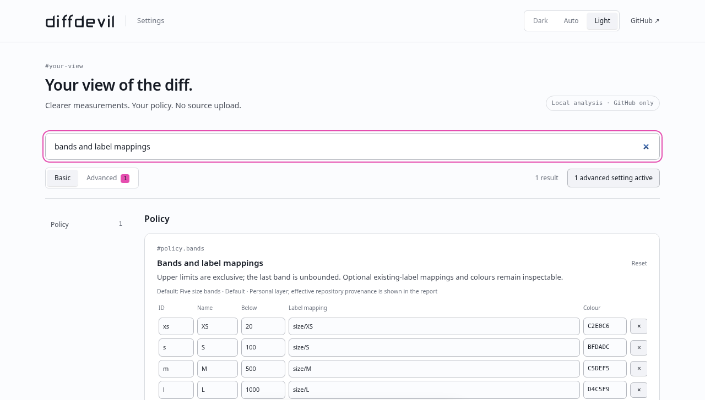

# diffdevil for GitHub

> [!NOTE]
> **In development**
> The local source build is available; public Store distribution and live release acceptance remain separate.

The browser extension brings Changed into the GitHub review you are already doing. It needs no repository workflow, App installation or write permission. Your browser acquires the comparison and runs the same engine as the CLI; the extension changes your view, not repository automation.

## Install and update

The source build targets Chrome Manifest V3. Use an unrestricted supported Chrome profile and a diffdevil checkout with Node.js 22.12 or newer. From the checkout root:

```sh
npm ci --ignore-scripts
npm run extension:dev
```

Open `chrome://extensions`, enable **Developer mode**, choose **Load unpacked**, and select `artifacts/browser-extension/unpacked/`. That stable directory is the development entry, not a SHA-named qualification archive. An organization's browser restrictions still apply; do not bypass them.

After rebuilding, use **Reload** on the extension card **and reload the GitHub tab**. Updating files does not replace an already injected content script. For released installation, the [extension product page](https://diffdevil.dev/extension/) supplies an actual Store destination when available. An unpublished listing is not an alternative download route. [Source build and qualification](../../../apps/browser-extension/README.md) remain the exact development instructions.

## Read the pull-request view

Open `https://github.com/OWNER/REPO/pull/NUMBER` for a PR you can read. Aggregate Changed follows the whole PR across Conversation, Commits, Checks and Files changed. The native raw additions/deletions stay available beside replacement-aware counts.

Click Changed to open its nonmodal report panel. Inspect the exact base/head, evidence, included files, metrics, scopes, bands, rules and policy origins. Escape, Close, clicking outside or clicking the anchor again dismisses it. The panel closes when its anchor is replaced rather than floating over unrelated content.

On the whole-PR **Files changed** view, each acquired file has its own Changed result and classification. A file does not inherit the aggregate PR tier. Excluded files retain measured facts but do not receive an included-policy classification. Per-file augmentation is deliberately absent from commit-only or narrowed comparisons, where whole-PR facts would describe the wrong input.

The [small shared specimen](../../examples/diffs/review.diff) produces 10 Changed and 16 raw churn under the default policy, including in the production browser projection. These are the same measurements explained in [Changed lines and raw churn](../understand/changed-lines-and-churn.md). Missing, bounded or binary evidence never becomes an invented exact count.

## Interpret a virtual band correctly

The pill and rail describe the effective policy in **your view**. They are not a GitHub label, an App check or proof that a workflow ran. A different classification can be legitimate when another surface uses different paths or thresholds; compare source and policy identities first.

An optional existing-label mapping can support a native handoff when GitHub exposes a writable label picker. The extension opens and filters that picker. **You make the actual GitHub selection.** The extension does not create labels, remove other labels or issue a hidden provider write. No writable picker means no native handoff, not a request for broader credentials.

The implemented App identity comparison does not supply an authenticated App report. This build presents local results; App-related preferences are inactive until a verified delivery source exists. It never guesses a report endpoint or launches a hosted analysis. The [App guide](managed-app/README.md) remains a separate in-development surface.

## Choose which policy you are seeing

Composed mode layers personal defaults, trusted repository policy, then an explicit personal repository override. Repository mode uses repository policy when present and personal defaults only when it is absent. Personal only deliberately excludes repository policy and can retain an explicit personal repository override.

Repository `.diffdevil.yml` and referenced templates come from the exact base revision, not the proposed head. An inaccessible or invalid policy is not an absent policy. Its failure remains visible; usable factual measurements can remain inspectable without inventing a replacement classification.

The report's provenance tells you which layer supplied a declaration. Settings in this browser do not edit the repository file, workflow inputs or App account defaults. Use [Source identity, trust, and mutation](../understand/trust-and-mutation.md) when comparing hosts.

## Find and change a setting

The toolbar icon opens the settings application. Search finds settings by human name, description and stable ID, including Advanced settings while Basic remains selected. A fragment such as `#policy.bands`, `#display.brandIcon` or `#policy.advancedYaml` on the extension's options page reveals and focuses that control. These are not product-site URLs.



This retained settings capture illustrates the source UI, not a live PR or evidence of Store publication. The current compiler and saved values govern the actual result.

Guided settings expose metric selection, paths and bands without requiring YAML. Band thresholds are ordered exclusive upper bounds; the last band is unbounded. Names, colors and optional existing-label mappings are distinct choices. Changing the classification metric does not redefine Changed.

Advanced YAML uses the full policy dialect. A nonempty Advanced document replaces the guided personal policy while preserving those guided preferences for later reuse. It does not grant effect authority. Searching, switching Basic/Advanced and changing theme retain unsaved editor content. Saving validates through the real schema/compiler; an invalid edit cannot replace the saved policy. Use a per-setting reset for a small correction rather than resetting everything.

## Export, import and manage local data

A full settings export contains configuration, including potentially private repository names and policy text. Import only a trusted configuration, inspect its validation result and provenance, and verify the intended saved settings. Do not confuse it with a redacted support snapshot. Repository overrides are explicit per-repository choices, not an automatically discovered organization policy.

Small display and guided-policy preferences use Chrome synchronized storage. Advanced YAML and repository overrides use local extension storage. The bounded least-recently-used cache holds normalized reports, paths, revisions, trusted policy text and exact-base absence results. It is rebuildable, but it is not independently encrypted and may disclose private repository details to someone with profile access.

Use the data controls to clear reports, clear repository-policy caches, clear overrides or reset all extension data. Destructive operations require confirmation. Clearing a cache does not change repository truth; an already rendered page may retain its view until refreshed. If storage fails, retain the diagnostic and retry the intended settings operation after repairing storage, rather than assuming a reset succeeded.

## Permissions and limitations

The manifest requests storage, the `github.com` content-script scope needed for PR navigation, and `api.github.com` for anonymous public fallback. Signed-in page acquisition and anonymous API fallback are different access routes. A private PR unavailable through the page cannot be made readable by the anonymous fallback.

Raw diffs and referenced template content are processed in memory rather than persisted as an analysis cache. There is no PAT prompt, cookie permission, browser-history API, all-sites permission, telemetry or diffdevil source-upload service. Browser sync is still a possible data transfer. Read the [extension privacy notice](../../../apps/browser-extension/privacy.md) before using private repositories or sharing configuration.

GitHub Enterprise hosts, Firefox and incognito are not supported by this build. GitHub DOM changes, provider throttling, missing patches, incomplete file acquisition and head movement can limit the result. The live-DOM/Store-assets repair in [PR #45](https://github.com/Wolfsblvt/diffdevil/pull/45) is a launch-target candidate, not landed behavior or a published extension.

## Recover and remove

**Nothing appears:** confirm the supported route, enabled setting, browser permission and post-install tab reload. **Only file results are absent:** check whether the comparison is narrowed, then inspect acquisition. **Facts without bands:** inspect policy origin and its diagnostic. **Stale result:** reacquire and compare the new revisions. **Rate-limited fallback:** retain the failure and retry later; thresholds cannot repair access.

For a useful support report, use the redacted diagnostic snapshot and include the affected route family and installed version without private source or credentials. A full settings export is not automatically safe to attach publicly.

To stop augmentation, disable it in settings or disable the extension. To remove it, use Chrome's extension removal control. Extension storage follows the browser's uninstall behavior; exported files remain wherever you saved them. This does not remove repository labels or uninstall a GitHub App. Return to [See changed lines on GitHub](../start/see-changed-lines-on-github.md) to verify a repaired first result.
