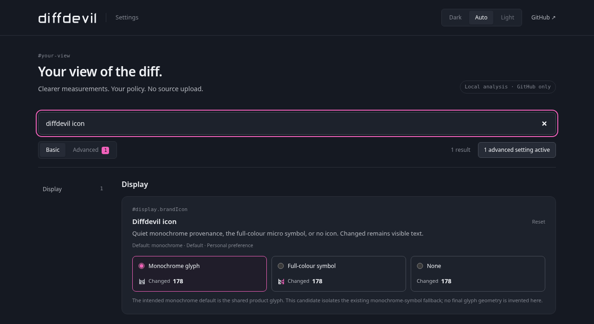

# diffdevil for GitHub

> [!NOTE]
> **In development**
> The extension can be built and loaded locally. A published Chrome Web Store listing is not yet established by this source.

See Changed while reviewing a pull request, without adding a repository workflow or installing the managed App. The extension uses the shared engine in its worker; its virtual classification is your reading aid, not a GitHub label, approval or quality judgment.

## Install and update

This build targets Chrome Manifest V3 on `github.com`. Firefox, GitHub Enterprise hosts and incognito operation are not supported. You need access to the PR and a browser profile that permits extension installation.

For local source use, obtain the repository at the source revision you intend to test. From its root with Node.js 22.12 or newer:

```sh
npm ci --ignore-scripts
npm run extension:dev
```

Open `chrome://extensions`, enable Developer mode, choose **Load unpacked**, and select `artifacts/browser-extension/unpacked`. This is the stable development directory; do not retain a temporary SHA-named qualification copy as your everyday extension path. The toolbar action opens settings.

After an update, rebuild, reload the extension card and reload open GitHub PR tabs. Already injected content scripts are not replaced retroactively. Managed browser policy can prohibit installation; that is an installation limitation, not something to bypass. A source build is not a Store installation or a guarantee that every current GitHub layout has been qualified.

## Read a pull request and a file

Open a supported PR and find Changed beside the native statistics. The aggregate follows the complete PR across Conversation, Commits, Checks and Files changed. Per-file augmentation belongs to the full-PR Files changed comparison. A commit-only or explicitly narrowed comparison must not borrow whole-PR file measurements.

Click Changed to open the non-modal report. Click it again, press Escape, click outside, or use Close to dismiss it. The report contains source revisions, evidence, files, metrics, bands, scopes, rules and policy provenance. An unacquired file keeps its native presentation instead of receiving an invented value.

The [first-use guide](../start/see-changed-lines-on-github.md) joins this view to the small 10 Changed / 16 raw churn specimen. [Changed lines and raw churn](../understand/changed-lines-and-churn.md) owns the counting explanation. Per-file classification uses that file's facts, not the aggregate tier. An excluded file can still have measured facts without belonging to the included classification.

Bounds, unknown and unmeasurable material stay visible. Compare the actual base/head and evidence before treating a cached display as current. Reload or retry acquisition after a moving revision; do not read missing augmentation as zero.

## Understand policy origin

The extension offers three deliberate policy modes:

| Mode | Configuration source |
| --- | --- |
| Composed | Personal defaults, then trusted repository policy, then an explicit personal repository override |
| Repository | Repository policy when present; personal defaults when it is genuinely absent |
| Personal only | Deliberately bypass repository policy; explicit personal repository overrides can still apply |

Repository `.diffdevil.yml` and explicitly referenced templates are read at the exact trusted base SHA, not from proposed PR-head configuration. A 404 on an inaccessible private base is not proof that the file is absent. Invalid or unavailable repository policy stays visible; it does not silently become a personal size classification. The acquired factual report can remain useful while classification is unavailable.

Your personal overrides are not repository changes. Different settings or source revisions can explain disagreement with an Action. Use the report's provenance and [trust model](../understand/trust-and-mutation.md) to compare like with like.

## Basic and Advanced settings

Settings have human-readable labels and literal deep links, such as `#display.brandIcon` and `#policy.advancedYaml`. Search includes Advanced descriptions even in the Basic view. A deep link reveals and focuses its target, while Basic reports active advanced changes. Unsaved editor content survives searching, view changes and theme changes.



Guided controls cover display and policy choices, including band thresholds, names, colors and optional mappings to existing native labels. Colors never establish an otherwise unknown band. The monochrome brand icon is the default; full color and no icon are explicit choices.

A nonempty Advanced YAML document replaces the guided personal policy. It preserves the guided preferences for later reuse rather than silently merging incompatible declarations into the advanced document. Saving uses the real compiler; invalid edits do not overwrite the saved policy. Keep a complete map where the policy contract requires one, rather than assuming the partial mapping conveniences in a browser form are portable policy syntax.


These images show the repository-owned settings UI, not a live GitHub result or proof of a published Store listing.

## Export, reset and repository overrides

Use the settings application's import/export route to move explicit preferences. A full settings export can contain private repository names and policy text; inspect it before sharing. Import is subject to settings and policy validation, not an unrestricted merge of arbitrary JSON.

Per-setting reset restores that setting. Clearing overrides, caches or all extension data is a separate destructive operation with confirmation. Export configuration you intend to keep before a whole-data reset. Removing a local override does not modify `.diffdevil.yml` in the repository.

When a native writable label picker is available, a deliberate handoff can open it and search for the mapped existing label. You perform the native selection. The extension does not select or create labels, reconcile a group, issue a hidden POST, or claim a write succeeded because the picker opened. Keep actual automation with its [chosen effect owner](shared-workflows/labels-comments-and-definitions.md).

## Data, caches and diagnostics

The extension reads the signed-in GitHub page when available and can fall back to anonymous public API reads that omit credentials. It does not request a PAT, collect cookies, run a localhost daemon, enumerate browser history or upload source to a Works backend. Analysis happens locally. GitHub still receives requests to its own resources.

Raw diffs and template contents are held in memory, not retained as the analysis cache. The bounded rebuildable LRU cache holds normalized reports, file paths, revisions, trusted repository-policy text and exact-base missing-file observations. Those can expose private repository information to someone with access to the browser profile; they are not independently encrypted.

Small display and guided-policy preferences use Chrome synchronized storage. Browser synchronization may send them to the browser provider. Large Advanced YAML and repository overrides stay in local extension storage. Local analysis therefore does not mean every preference stays on one device.

Diagnostic history contains codes and timestamps rather than raw patches or policy expressions. A support snapshot removes repository identities, paths, policy and source. Use that redacted route for a public report, not an unexamined settings export. The [extension privacy notice](../../../apps/browser-extension/privacy.md) owns the full data contract.

## Recover a missing or incorrect result

First check the installation and whether the route is supported. Then separate a missing mount from acquisition failure, inaccessible policy, stale revisions or bounded evidence. Open settings and diagnostics for the relevant code; retry a transient acquisition, repair invalid configuration, or deliberately select Personal only when a personal interpretation is the job. Clearing caches is not a repair for missing permission or an invalid policy.

GitHub changes its DOM independently. Additional tokenized-header mounting and durable Store-asset work is an open [launch-target candidate in PR #45](https://github.com/Wolfsblvt/diffdevil/pull/45), not part of the admitted implementation described here. Missing provider anchors in that boundary can prevent visible augmentation. Do not interpret an open candidate or a prepared asset generator as a released fix or a submitted listing.

The extension currently presents local results. It has no authenticated delivery of managed-App reports; its App matching preferences do not establish a matching remote check or trigger hosted analysis. This does not require the App to use ordinary local analysis.

To stop using it, disable augmentation or remove the extension through Chrome. Clear reports, repository-policy caches or all settings first when that is your intended data operation. An open page can retain already rendered facts until reloaded or closed. Uninstallation removes extension storage according to the browser's behavior; it does not delete GitHub data or revoke a separately installed App.
